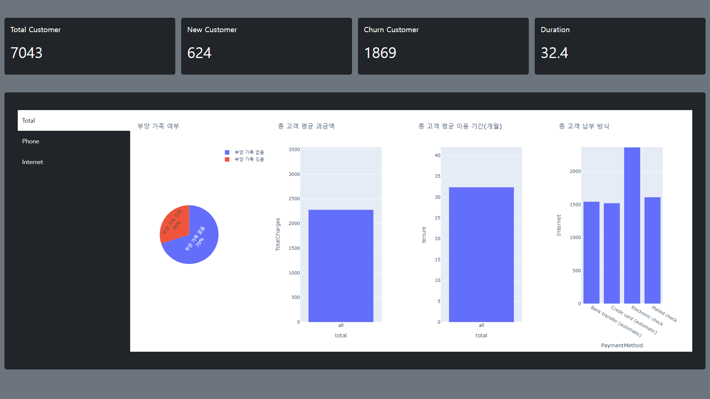
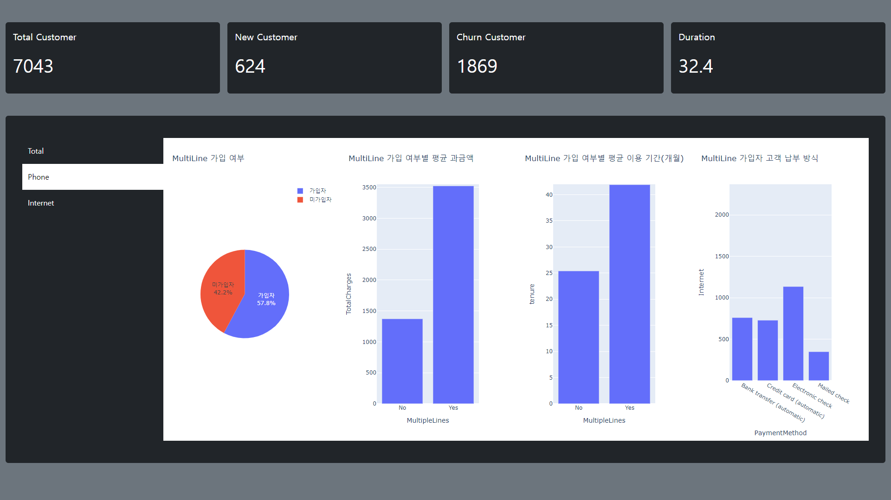
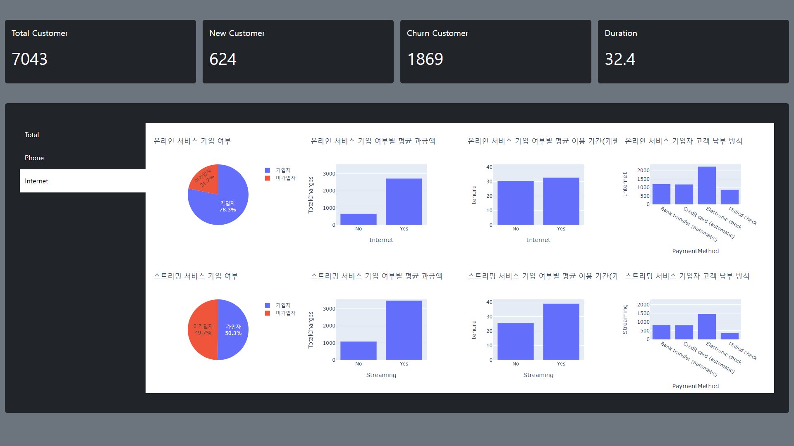

# Telco 고객 대시보드

## 목적
- 고객 데이터를 통해 서비스별 고객 행동을 파악하여 서비스 전략 등 마련

## 활용
- 고객 관리, 마케팅 및 프로모션 전략 기획

## 사용 데이터
- Telco Customer Churn(kaggle) https://www.kaggle.com/datasets/blastchar/telco-customer-churn
- 위의 데이터로 필요한 지표를 만들 수 없는 경우, 임의로 계산한 부분이 있습니다.

## 결과물

## 도구
- Flask, Jinja2
- Ajax, XMLHttpRequest, Javascript, HTML, CSS
- Pandas, Plotly